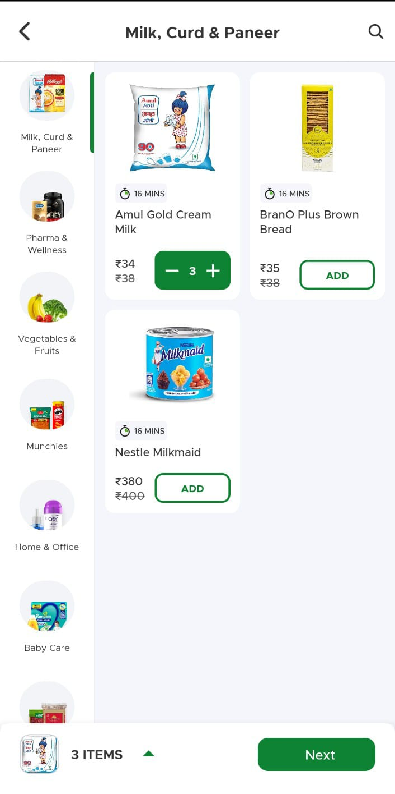
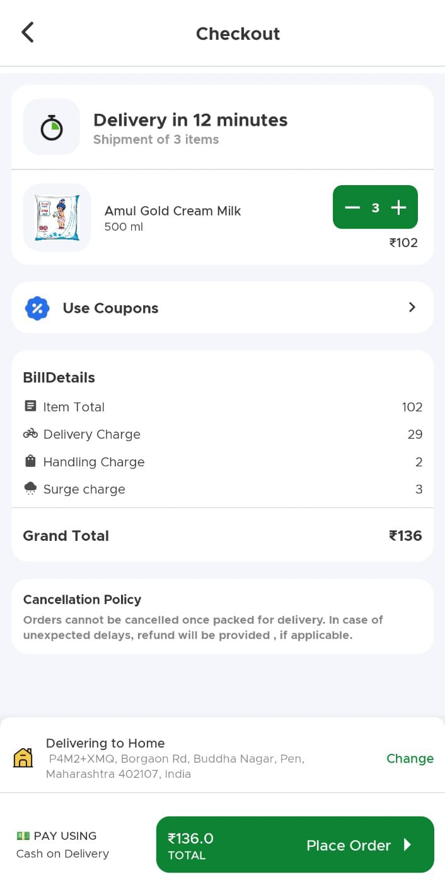
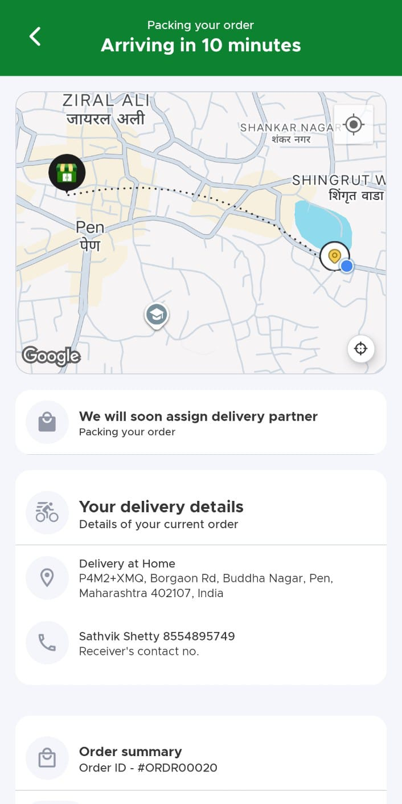
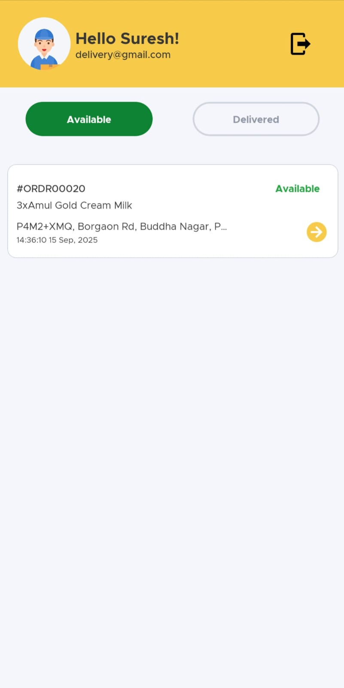
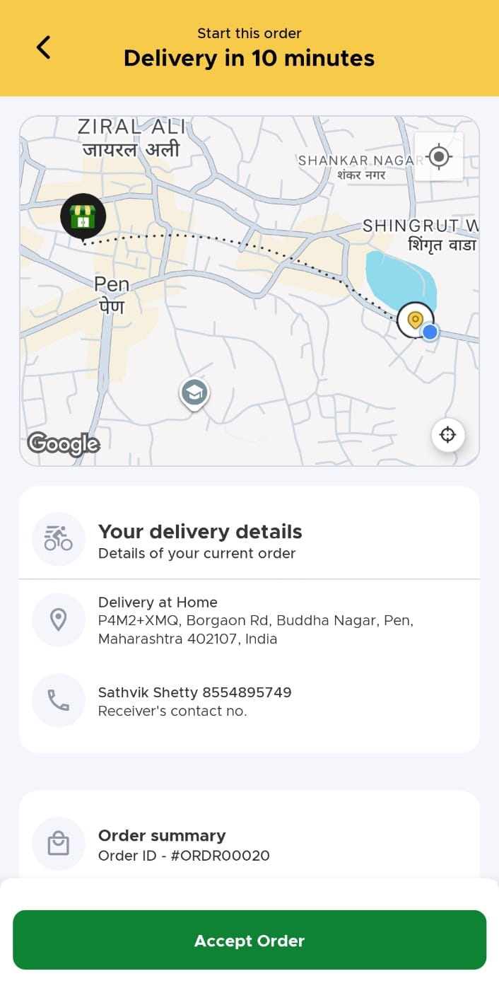
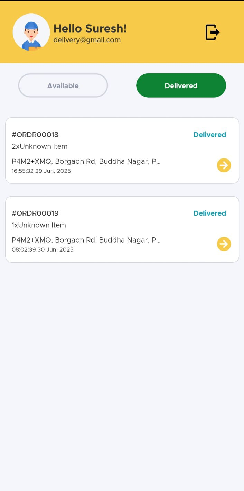

  <div align="center">
  <h1>🛒 Grocery Delivery App</h1>
  <p>A comprehensive dual-platform grocery delivery solution for customers and delivery partners</p>
  
  <div>
    
    
    
    
    
  </div>

  <br />

  <!-- App Preview GIFs -->
<h2>📸 App Previews</h2>
<p><em>Complete customer & delivery partner experience showcase 🚀</em></p>

### 🔐 **Authentication & Onboarding**
<table>
  <tr>
    <td align="center">
      
      <br/><b>🔐 Customer Login</b>
      <br/><sub>OTP-based authentication with smooth animations</sub>
    </td>
    <td align="center">
      
      <br/><b>🚚 Delivery Partner Portal</b>
      <br/><sub>Dedicated delivery partner authentication</sub>
    </td>
  </tr>
</table>

### 🛍️ **Customer Shopping Experience**
<table>
  <tr>
    <td align="center">
      
      <br/><b>🏠 Product Discovery</b>
      <br/><sub>Browse categories with smooth navigation</sub>
    </td>
    <td align="center">
      
      <br/><b>➕ Add to Cart</b>
      <br/><sub>Milk, Dairy & Paneer with quantity controls</sub>
    </td>
  </tr>
</table>

### 🛒 **Shopping Cart & Checkout Flow**
<table>
  <tr>
    <td align="center">
      
      <br/><b>💳 Seamless Checkout</b>
      <br/><sub>Detailed bill breakdown with delivery charges</sub>
    </td>
    <td align="center">
      
      <br/><b>✅ Order Confirmation</b>
      <br/><sub>Real-time packing status with ETA & map</sub>
    </td>
  </tr>
</table>

### 📍 **Order Tracking & Live Updates**
<table>
  <tr>
    <td align="center">
      
      <br/><b>📋 Available Orders</b>
      <br/><sub>Delivery partner view of orders to accept</sub>
    </td>
    <td align="center">
      
      <br/><b>⚙️ Admin Management Panel</b>
      <br/><sub>Inventory, branches & delivery partner management</sub>
    </td>
  </tr>
</table>

### 🚚 **Delivery Partner Experience**
<table>
  <tr>
    <td align="center">
      
      <br/><b>🗺️ Live Delivery Navigation</b>
      <br/><sub>Interactive GPS map with customer location</sub>
    </td>
    <td align="center">
      
      <br/><b>✅ Delivery Completed</b>
      <br/><sub>Order delivered successfully status</sub>
    </td>
  </tr>
</table>

### 🎯 **Complete User Journey Overview**
<div align="center">
  
| **Step** | **Customer Experience** | **Delivery Partner Experience** | **Admin Experience** |
|----------|-------------------------|----------------------------------|---------------------|
| **1. Authentication** | 📱 OTP-based login | 🔐 Email/Password portal | 🛡️ Admin dashboard access |
| **2. Browse/Receive** | 🛍️ Category browsing | 📦 Order notifications | 📊 Monitor all activities |
| **3. Add/Accept** | ➕ Add to cart | ✅ Accept orders | 🏪 Manage inventory |
| **4. Checkout/Navigate** | 💳 Secure checkout | 🗺️ GPS navigation | 👥 Manage delivery partners |
| **5. Track/Deliver** | 📍 Live tracking | ✅ Complete delivery | 📈 Analytics & reports |

</div>

### ✨ **Key Features Highlighted**

<div align="center">

🎨 **Smooth Animations** • 📍 **Real-time GPS** • 🔔 **Push Notifications** • 💳 **Secure Payments**

🛒 **Smart Cart** • 🗺️ **Interactive Maps** • ⚡ **Lightning Fast** • 📱 **Responsive Design**

⚙️ **Admin Panel** • 📊 **Analytics Dashboard** • 🏪 **Inventory Management** • 👥 **User Management**

</div>

### 🏗️ **Three-Tier Architecture**

<table>
  <tr>
    <th width="33%">👨‍💻 Customer App</th>
    <th width="33%">🚚 Delivery Partner App</th>
    <th width="33%">⚙️ Admin Dashboard</th>
  </tr>
  <tr>
    <td align="center">
      • Product browsing<br/>
      • Cart management<br/>
      • Order placement<br/>
      • Live tracking<br/>
      • Payment processing
    </td>
    <td align="center">
      • Order notifications<br/>
      • GPS navigation<br/>
      • Status updates<br/>
      • Earnings tracking<br/>
      • Route optimization
    </td>
    <td align="center">
      • Inventory management<br/>
      • User management<br/>
      • Branch operations<br/>
      • Analytics & reports<br/>
      • System configuration
    </td>
  </tr>
</table>

---

<div align="center">
<p><em>📱 A complete ecosystem for modern grocery delivery with customer, delivery partner, and admin experiences 🚚</em></p>

**🌟 Experience the future of grocery delivery - Three apps in one ecosystem! 🌟**

<div style="margin: 20px 0;">
  
  
  
</div>

</div>

### ✨ **Key Features Highlighted**

<div align="center">

🎨 **Smooth Animations** • 📍 **Real-time GPS** • 🔔 **Push Notifications** • 💳 **Secure Payments**

🛒 **Smart Cart** • 🗺️ **Interactive Maps** • ⚡ **Lightning Fast** • 📱 **Responsive Design**

</div>

---

<div align="center">
<p><em>📱 A modern grocery shopping experience with real-time delivery tracking 🚚</em></p>

**🌟 Experience the future of grocery delivery - Download now! 🌟**
</div>


  <!-- Screenshots placeholder -->
 
</div>

## ✨ Key Highlights

🎯 **Dual Platform Architecture**
- **Customer App**: Browse, shop, track orders
- **Delivery Partner App**: Receive orders, navigate, update status

🚀 **Real-time Features**
- Live order tracking with Socket.IO
- Real-time delivery status updates
- Interactive maps with directions
- Push notifications and alerts

💎 **Premium User Experience**
- Smooth carousel animations
- Auto-scrolling product banners
- Gesture-based interactions
- Responsive typography and layouts

## 📱 Main Screens Overview

### 🔐 Authentication Flow
- **Splash Screen** (`src/features/auth/SplashScreen.tsx`)
  - Animated brand introduction
- **Customer Login** (`src/features/auth/CustomerLogin.tsx`)
  - Customer authentication with JWT
- **Delivery Login** (`src/features/auth/DeliveryLogin.tsx`)
  - Delivery partner authentication

### 🛍️ Customer Experience
- **Product Dashboard** (`src/features/dashboard/ProductDashboard.tsx`)
  - Animated header with search
  - Product carousels and categories
  - Featured products and offers
- **Product Categories** (`src/features/category/ProductCategories.tsx`)
  - Sidebar navigation
  - Filterable product lists
  - Add to cart functionality
- **Cart & Checkout** (`src/features/cart/`)
  - Cart animation wrapper
  - Order summary and pricing
  - Checkout flow
- **Order Tracking** (`src/features/map/LiveTracking.tsx`)
  - Real-time GPS tracking
  - Delivery partner location
  - ETA and route visualization
- **Profile Management** (`src/features/profile/Profile.tsx`)
  - User preferences and settings

### 🚚 Delivery Partner Experience
- **Delivery Dashboard** (`src/features/delivery/DeliveryDashboard.tsx`)
  - Active orders management
  - Earnings tracker
  - Performance metrics
- **Delivery Map** (`src/features/delivery/DeliveryMap.tsx`)
  - Navigation to customer
  - Order details overlay
  - Status update controls

## 🏗️ Architecture & Tech Stack

### 📱 **Frontend**
- **React Native** `0.77.0` - Latest stable version
- **TypeScript** `5.0.4` - Type-safe development
- **React Navigation** `7.x` - Screen navigation

### 🗄️ **State Management**
- **Zustand** `5.0.3` - Lightweight state management
- **MMKV** `3.2.0` - Ultra-fast key-value storage
- **JWT Decode** `4.0.0` - Token management

### 🎨 **UI & Animations**
- **Lottie React Native** `7.2.2` - Beautiful animations
- **React Native Reanimated** `3.16.7` - 60fps animations
- **Reanimated Carousel** `3.5.1` - Smooth carousels
- **Auto Scroll** - Automated content scrolling
- **Linear Gradient** `2.8.3` - Gradient backgrounds
- **Vector Icons** `10.2.0` - Comprehensive icon library
- **SVG Support** `15.11.1` - Scalable vector graphics

### 🗺️ **Location & Maps**
- **React Native Maps** `1.20.1` - Interactive maps
- **Maps Directions** `1.9.0` - Route navigation
- **Geolocation** `3.4.0` - GPS positioning

### 🔄 **Real-time Communication**
- **Socket.IO Client** `4.8.1` - Real-time updates
- **Axios** `1.7.9` - HTTP client

### 🛠️ **Development Tools**
- **ESLint** `8.19.0` - Code linting
- **Prettier** `2.8.8` - Code formatting
- **Jest** `29.6.3` - Testing framework
- **Patch Package** - Dependency patching

## 🗂️ Project Structure

```
🗂️ grocery_app/
├── 📁 src/
│   ├── 🎨 assets/           # Images, fonts, animations
│   │   ├── animations/      # Lottie animation files
│   │   ├── category/        # Category images
│   │   ├── fonts/          # Custom fonts
│   │   ├── icons/          # App icons
│   │   ├── images/         # Static images
│   │   └── products/       # Product images
│   ├── 🧩 components/       # Reusable UI components
│   │   ├── dashboard/       # Dashboard components
│   │   ├── delivery/        # Delivery components
│   │   ├── global/          # Global components
│   │   ├── login/           # Login components
│   │   ├── map/            # Map components
│   │   └── ui/             # UI components
│   ├── 🎯 features/         # Feature modules
│   │   ├── auth/           # Authentication
│   │   ├── cart/           # Shopping cart
│   │   ├── category/       # Product categories
│   │   ├── dashboard/      # Main dashboard
│   │   ├── delivery/       # Delivery features
│   │   ├── map/           # Map & tracking
│   │   ├── order/         # Order management
│   │   └── profile/       # User profile
│   ├── 🧭 navigation/      # Navigation configuration
│   ├── 🌐 service/         # API services
│   ├── 🔄 state/          # State management
│   │   ├── authStore.tsx   # Authentication state
│   │   ├── cartStore.tsx   # Cart state
│   │   ├── mapStore.tsx    # Map state
│   │   └── storage.tsx     # Persistent storage
│   ├── 🎨 styles/         # Global styles
│   └── 🔧 utils/          # Utility functions
├── 🗄️ server/             # Backend server (if applicable)
├── 📱 android/            # Android specific code
├── 🍎 ios/               # iOS specific code
└── 📄 App.tsx            # Root component
```

## 🚀 Getting Started

### 📋 Prerequisites

Ensure you have the following installed:

- ✅ [Node.js](https://nodejs.org/) (>= 18.0.0)
- ✅ [React Native CLI](https://reactnative.dev/docs/environment-setup)
- ✅ [Android Studio](https://developer.android.com/studio) (for Android)
- ✅ [Xcode](https://developer.apple.com/xcode/) (for iOS, macOS only)
- ✅ [JDK 17](https://www.oracle.com/java/technologies/javase/jdk17-archive-downloads.html)

### 🔧 Installation

1. **Clone the repository**
   ```bash
   git clone <your-repo-url>
   cd grocery_app
   ```

2. **Install dependencies**
   ```bash
   npm install
   ```

3. **Link custom fonts**
   ```bash
   npm run link:fonts
   ```

4. **iOS Setup** (macOS only)
   ```bash
   cd ios && pod install && cd ..
   ```

### ▶️ Running the App

1. **Start Metro bundler**
   ```bash
   npm start
   ```

2. **Run on Android**
   ```bash
   npm run android
   ```

3. **Run on iOS** (macOS only)
   ```bash
   npm run ios
   ```

## 🌟 Key Features in Detail

### 🛍️ **For Customers**
- **Smart Product Search**: Intelligent search with filters and categories
- **Interactive Cart**: Real-time cart updates with animations
- **Live Order Tracking**: GPS-based real-time delivery tracking
- **Personalized Experience**: User preferences and order history
- **Multiple Payment Options**: Secure payment integration

### 🚚 **For Delivery Partners**
- **Order Management**: Accept/reject orders with smart routing
- **Navigation Integration**: Turn-by-turn directions to customers
- **Earnings Tracking**: Real-time earnings and performance metrics
- **Status Updates**: Easy order status management
- **Optimized Routes**: AI-powered route optimization

### 🔄 **Real-time Features**
- **Live Updates**: Socket.IO powered real-time communication
- **Push Notifications**: Instant order and delivery updates
- **Location Tracking**: Accurate GPS tracking for deliveries
- **Chat Support**: In-app communication between customers and delivery partners

## 🧪 Testing & Development

```bash
# Run tests
npm test

# Lint code
npm run lint

# Apply patches after npm install
npm run postinstall
```

## 📱 Platform Support

| Platform | Support | Version |
|----------|---------|----------|
| 🤖 Android | ✅ | API 21+ |
| 🍎 iOS | ✅ | iOS 12+ |

## 🚀 Deployment

### Android
```bash
# Generate APK
cd android && ./gradlew assembleRelease
```

### iOS
```bash
# Open in Xcode for archiving
open ios/grocery_app.xcworkspace
```

## 🤝 Contributing

1. 🍴 Fork the repository
2. 🌿 Create feature branch (`git checkout -b feature/amazing-feature`)
3. ✅ Commit changes (`git commit -m 'Add amazing feature'`)
4. 📤 Push to branch (`git push origin feature/amazing-feature`)
5. 🔄 Open a Pull Request

## 📄 License

This project is licensed under the MIT License - see the [LICENSE](LICENSE) file for details.

## 🙏 Acknowledgments

- **React Native Community** - For the amazing framework
- **Zustand** - For lightweight state management
- **Lottie** - For beautiful animations
- **Socket.IO** - For real-time communication
- **React Native Maps** - For map integration

## 📞 Support

If you need help or have questions:
- 🐛 [Report Issues](../../issues)
- 💬 [Start Discussion](../../discussions)
- 📧 Contact the development team

---

<div align="center">
  <p>🛒 Built with ❤️ for seamless grocery delivery experiences</p>
  <p>⭐ Star this repo if it helps you!</p>
</div>
